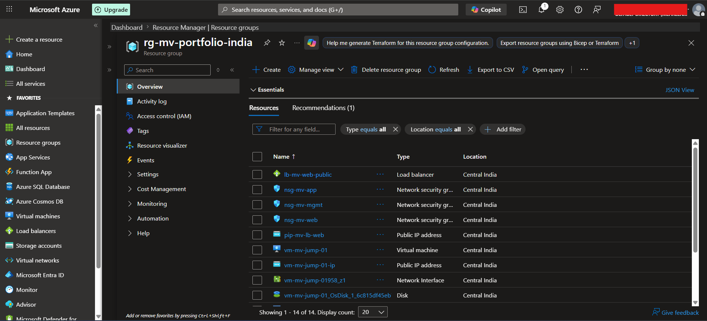
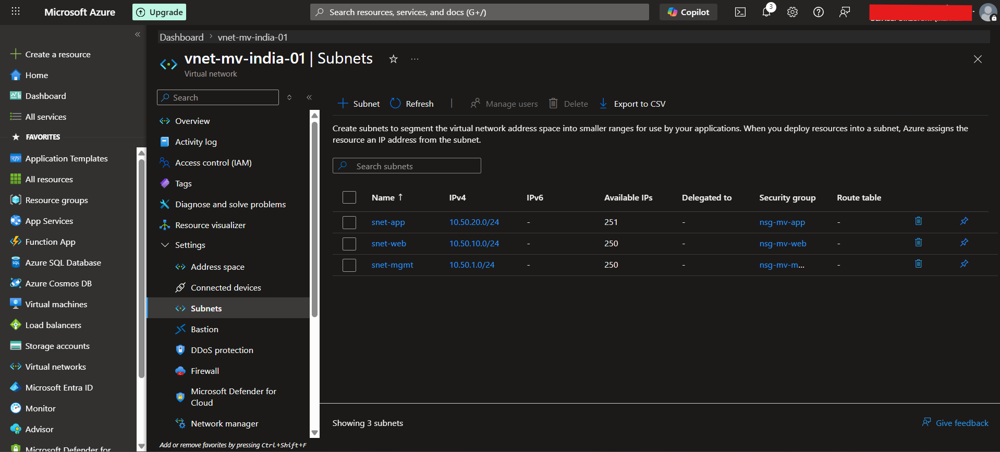
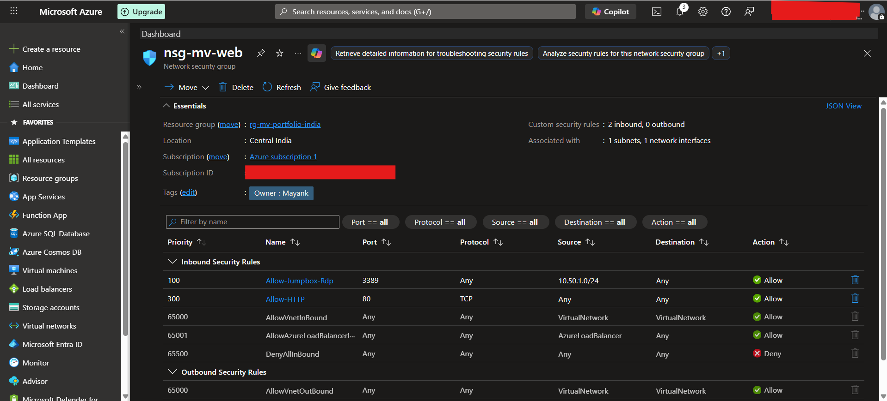
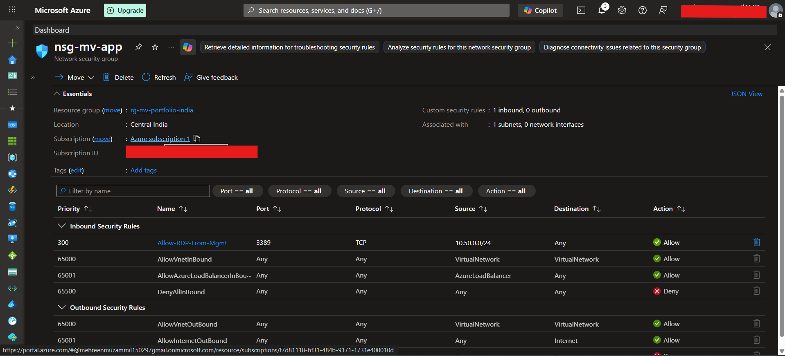
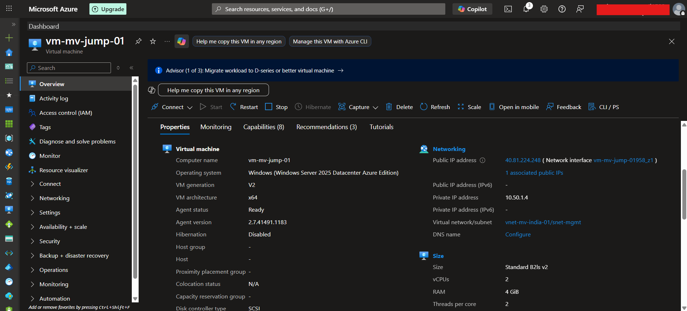
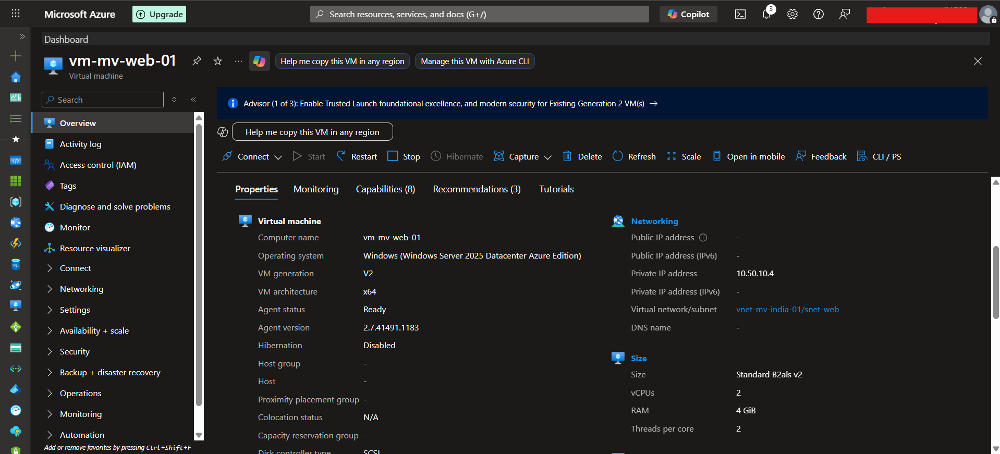
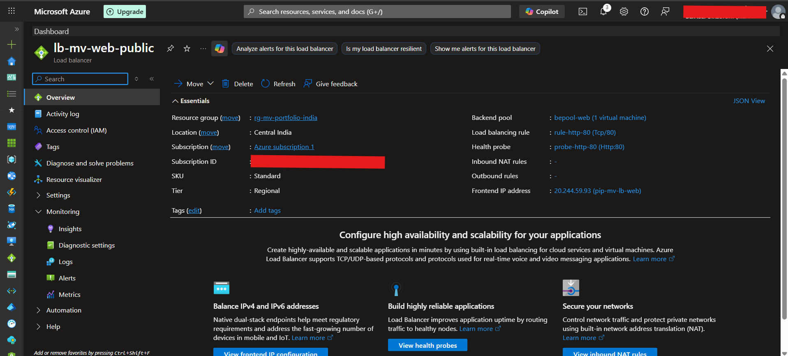
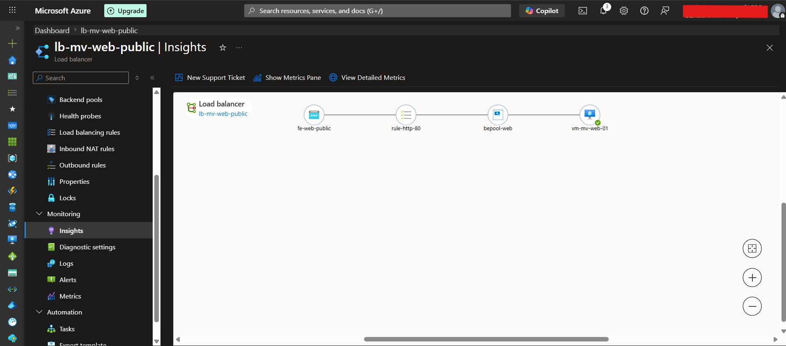
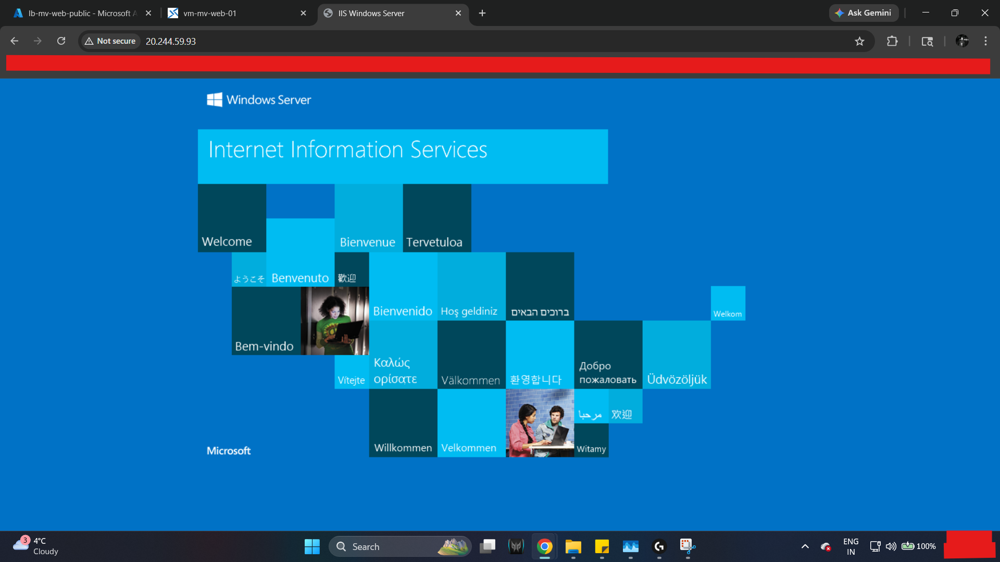

# Azure Secure Web Architecture Project

## Project Overview

This project was built to simulate a secure Azure web deployment using a segmented virtual network, subnet-level security controls, a management access path, and a Standard Public Load Balancer placed in front of a private IIS web server.

The goal was to build something that reflected real infrastructure thinking rather than just a basic VM deployment. Instead of assigning a public IP directly to the web server, the environment was designed so that the web tier stayed private and HTTP traffic was exposed only through the load balancer. Administrative access was kept separate through a management path.

---

## Objective

Design and implement a secure Azure web architecture that:

- Uses segmented subnets for management, web, and application tiers
- Restricts administrative access through a management VM
- Keeps the web server private
- Exposes HTTP traffic through a Standard Public Load Balancer
- Applies NSG-based traffic control at the subnet level
- Works within free-tier / low-quota Azure constraints

---

## Project Requirements and Constraints

This project was intentionally designed under realistic limitations:

- Maximum of **2 Windows Server VMs**
- Needed to work under **Azure free-tier / limited vCPU quota**
- Web server should **not** have a direct public IP
- Administrative access should be separated from public web traffic
- Public access should be validated only through the **Load Balancer frontend IP**
- Architecture should be documented clearly enough to explain in interviews

These constraints shaped the final design and forced the implementation to stay practical and cost-conscious.

---

## Architecture Summary

### Core Components
- **Virtual Network:** `vnet-mv-india-01`
- **Subnets:**
  - `snet-mgmt`
  - `snet-web`
  - `snet-app`
- **Network Security Groups:**
  - `nsg-mv-mgmt`
  - `nsg-mv-web`
  - `nsg-mv-app`
- **Virtual Machines:**
  - `vm-mv-jump-01` → management / jumpbox VM
  - `vm-mv-web-01` → private IIS web server
- **Load Balancer:**
  - `lb-mv-web-public`
- **Public IP:**
  - `pip-mv-lb-web`

---

## Traffic Flow Logic

### Administrative Access
1. RDP access is allowed only to the **jumpbox VM**
2. The jumpbox sits in the **management subnet**
3. From there, internal administrative access can be used to reach other private resources

### Web Access
1. Users connect to the **public IP of the Standard Load Balancer**
2. The Load Balancer uses an **HTTP health probe** on port 80
3. If the backend is healthy, traffic is forwarded to the private IIS web server in the **web subnet**
4. The web VM itself does **not** require a direct public IP

This pattern separates public web access from direct server exposure and reflects a stronger security design than exposing the VM directly.

---

## Security Design

### 1. Segmented Subnets
The environment is split into separate subnets for management, web, and application roles. This keeps responsibilities isolated and makes traffic control easier.

### 2. NSG-Based Control
Subnet-level NSGs are used to control traffic:

- `nsg-mv-mgmt` protects the management subnet
- `nsg-mv-web` allows HTTP traffic to the web subnet and restricts administrative access
- `nsg-mv-app` allows RDP only from the management subnet

### 3. Private Web Server
The IIS server is hosted on a private VM and accessed publicly only through the Load Balancer frontend.

### 4. Management Path
Instead of opening broad administrative access, a separate management VM is used as the controlled entry point.

---

## Implementation Summary

### Phase 1: Existing Secure Network Base
An earlier secure network setup already included:
- a jumpbox VM
- a web VM
- segmented management and web subnets
- initial NSG structure

### Phase 2: Architecture Expansion
This project expanded the environment by:
- adding an **application subnet**
- creating and attaching `nsg-mv-app`
- defining subnet-level separation more clearly
- preserving the jumpbox-based management model

### Phase 3: Public Web Exposure Through Load Balancer
The web VM remained private while a Standard Public Load Balancer was added with:
- a frontend public IP
- backend pool targeting the web VM NIC
- HTTP health probe on port 80
- load balancing rule for HTTP traffic

### Phase 4: Validation
The architecture was validated by:
- confirming IIS worked on the private web VM
- confirming the backend health probe turned healthy
- accessing the IIS page successfully through the **Load Balancer public IP**

---

## Validation Results

Successful validation points:

- IIS was reachable locally on the web VM
- NSG rules allowed the intended traffic paths
- HTTP probe returned healthy status
- Load Balancer frontend successfully served the IIS page publicly
- Web server remained private while still being publicly reachable through the correct path

---

## Screenshots

## 1. Resource Group Overview
Shows the main Azure resources created for the deployment.

## 2. VNet and Subnets
Shows the segmented network design with management, web, and application subnets.

## 3. Web NSG Rules
Shows the NSG rules protecting the web subnet, including HTTP access.

## 4. App NSG Rules
Shows the app subnet restriction model, including RDP access from the management subnet.

## 5. Jumpbox VM Overview
Shows the management VM used as the controlled administrative entry point.

## 6. Web VM Overview
Shows the private IIS web server used as the backend target behind the Load Balancer.

## 7. Load Balancer Overview
Shows the public Standard Load Balancer that fronts the private web server.

## 8. Load Balancer Health / Insights
Shows the backend health state and confirms probe success.

## 9. Public Test Result
Shows the IIS page loading through the Load Balancer public IP.

---

## What I Learned

This project helped reinforce the difference between simply deploying VMs and designing actual cloud infrastructure.

Key takeaways:
- why keeping backend systems private is better than assigning public IPs directly
- how subnet segmentation improves control and clarity
- how NSGs shape traffic flow between tiers
- how Azure Load Balancer health probes determine backend availability
- how to design under quota and cost constraints without losing architectural quality

---

## Future Improvements

Planned next steps for this project:

- add **Azure Monitor / Log Analytics**
- expand the app tier further
- export the resource group as **ARM / Bicep**
- add an architecture diagram
- document cost-control strategy for deallocated resources

---

## Resume Bullet Version

Designed and implemented a secure Azure web architecture using segmented management, web, and application subnets, NSG-based traffic controls, a jumpbox administration model, and a Standard Public Load Balancer to expose a private IIS web server under free-tier compute constraints.